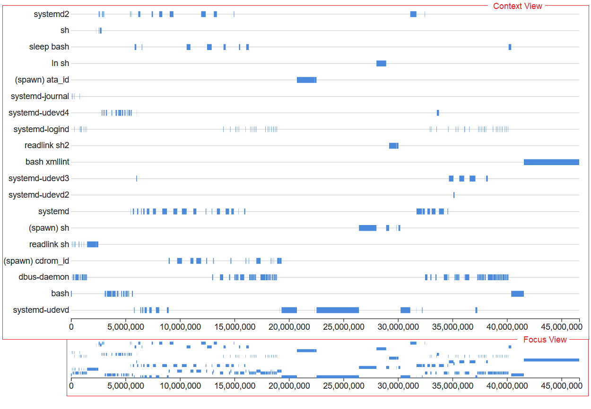

# pandeagle
PANDeagle -- visualizing and exploring PANDA results

## Installation

Clone the repository.
```
git clone git@github.com:panda-re/pandeagle.git
cd pandeagle
```
This project needs NPM to work, if not already installed:
```
sudo apt install npm
```
Use NPM to install dependency packages.
```
npm install
```
Start the application (running on PORT 3000 on local machine).
```
npm start
```
Access the application by going to http://localhost:3000 in the browser.

The database connected by the application is specified in config.json.

## UI Elements



* Adapted from Mike Bostock's [Focus + Context](https://observablehq.com/@d3/focus-context?collection=@d3/d3-brush) example

## Features in Progress

- [x] Zooming and Panning
- [ ] Searching and Filtering 
